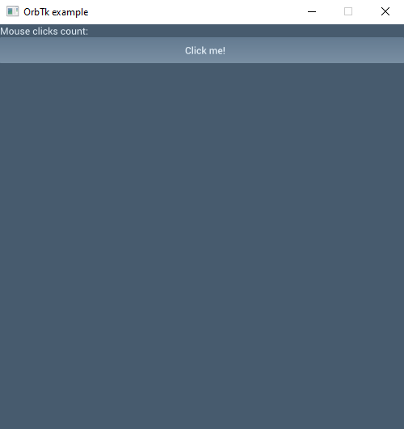

# Application development with the Orbital Toolkit

## Chapter 01
In this chapter, we will create a so called Counter app to learn the basics of orbtk.
We will have a button, and a text label showing the number of mouse clicks on the button.
Clicking on the button will increase the counter.

### Create a new project
Navigate to your Projects folder, or whatever folder you want to your project would be created.  
Open a new terminal, and issue the following command:

```
cargo new counter_app --bin
```

It orders [Cargo](https://doc.rust-lang.org/cargo/), the Rust build system and package manager to create a new binary executable with the name of counter_app
(it needs to be executable, because orbtk is a library, it cannot run on own and will be linked to your app's executable).

Navigate to the freshly created folder by issuing a new command to the terminal:
```
cd counter_app
```

### Adding orbtk as a dependency
Now, there should be a file called Cargo.toml in our project folder (it is created by Cargo when we generated the project).
Open it with a text editor/IDE and copy/paste the following line after the [dependencies] section:

> orbtk = "0.3.1-alpha3"

or if you want to use the latest codebase (it might contain braking changes to your code):

> orbtk = { git = "https://github.com/redox-os/orbtk.git", branch = "develop" }

Note: you can read more about the Cargo and dependency managament in the [Rust book](https://doc.rust-lang.org/book/ch01-03-hello-cargo.html).

### Start coding !
Now open the previously generated main.rs in the src directory, and replace its content with:

```rust
use orbtk::prelude::*;

fn main() {
    Application::new()
        .window(|ctx| {
            Window::new()
                .title("OrbTk example")
                .position((125.0, 125.0))
                .size(500, 500)
                .child(
                    Stack::new()
                        .child(
                            TextBlock::new()
                            .text("Mouse clicks count:")
                            .build(ctx)
                        )
                        .child
                            (Button::new()
                            .text("Click me!")
                            .build(ctx)
                        )
                        .build(ctx),
                )
                .build(ctx)
        })
        .run();
}

```

Now run this piece of code, and lets see what we have done !
```
cargo run
```

You should see this ("it ain't much, but it's honest work"):  
  
(dont worry about the looks, we will learn custom theming in a chapter later)

Great ! Now lets go through it step by step.  
First, we create an [Application](https://github.com/redox-os/orbtk/blob/develop/crates/api/src/application/mod.rs#L23) struct.  
It is our entry point into the orbtk world, it connects your executable with the lib.  
Then, we define a [Window](https://github.com/redox-os/orbtk/blob/develop/crates/widgets/src/window.rs) on the Application.
We set the initial values of some properties of a Window, like its title, its position on the screen, its size by using the provided [Builder pattern](https://en.wikipedia.org/wiki/Builder_pattern) (fluent API).

We want to display two widgets on the screen: The [TextBlock](https://github.com/redox-os/orbtk/blob/develop/crates/widgets/src/text_block.rs) (label) and a [Button](https://github.com/redox-os/orbtk/blob/develop/crates/widgets/src/button.rs).
To achieve this, we need to add three children to the Window: since Window is a widget, we could add children to it.  
In orbtk, widgets has a (one-to-many) parent-children relationship.Every widget has only one parent, and it could have many children.  
The only widget has no parent is the root widget, which is the Window.
You should see a pattern here: widget, widget, widget: in orbtk (almost) everything is a widget, just like everything is a class in Java, or everything is a pointer in C :).

The first child of the Window is a [Stack](https://github.com/redox-os/orbtk/blob/develop/crates/widgets/src/stack.rs) layout widget: its job is to stack its children horizontally or vertically (the default is vertical).
If we had'nt added it to the Window, the TextBlock and the Button would be placed on top of each other, since we did'nt set their positions in the builder API.  
Then we add our two remaining widgets as a childrend of the Stack with setting the text property of the TextBlock and the Button.  
Finally, we call the run() method to start our Application.

Now, if you click on the Button, you should notice that nothing happens.
This is not okay, since we want count the mouse clicks.
Lets move to the [next section](https://github.com/kivimango/orbtk_blog/blob/main/01A_basics.md) to add some interactivity to our widgets.

### Summary
Today we learned about: 
* the Application entry point
* the Window widget
* the Builder pattern